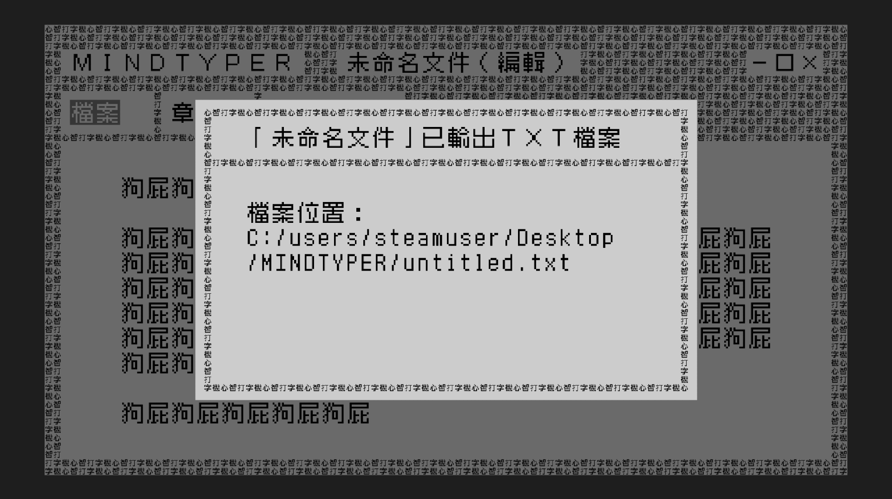
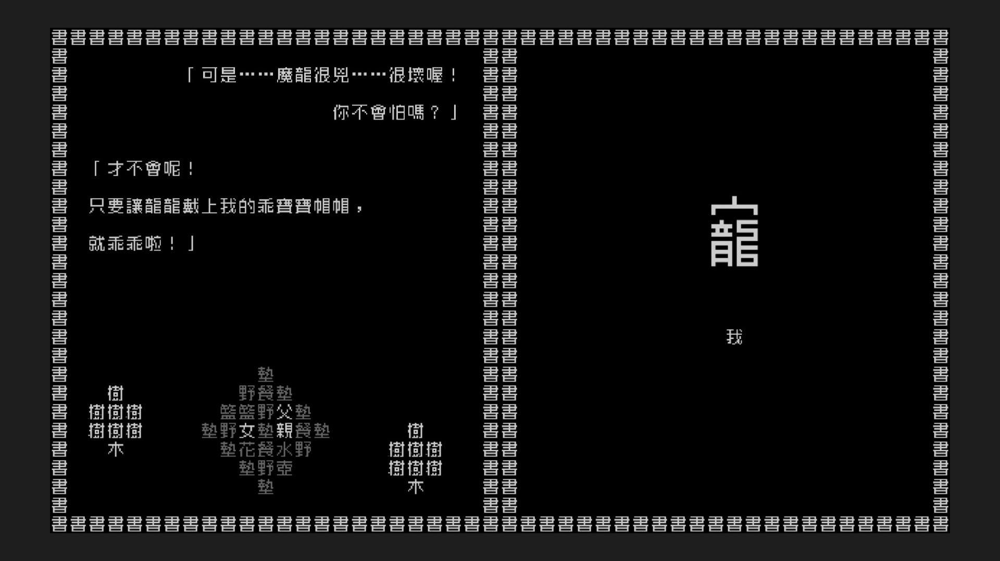
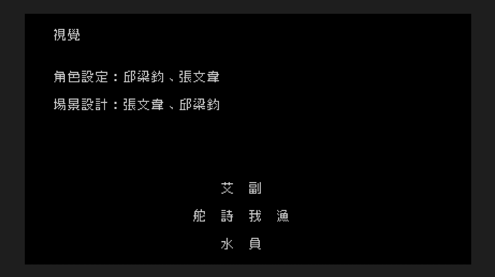

# 文字遊戲 Steam Play 運行問題迴避工具<br>Word Game(文字遊戲) Steam Play Workarounds

讓文字遊戲能夠順利於 Steam Play 運行  
Let "Word Game" game title can be run properly under Steam Play

 [](https://pre-commit.com/) [](https://api.reuse.software/info/github.com/brlin-tw/wordgame-steam-play-workarounds)

## 使用說明<br>Usage

### 使用流程<br>Usage instructions

1. 下載本專案的封存檔  
   Download repo archive of this project
1. 解開封存檔  
   Extract the archive
1. 開啟一文字終端  
   Launch a text terminal
1. 切換工作目錄到封存檔解開目錄  
   Change the working directory to the extracted directory
1. 參閱[使用流程 > 可變更腳本運行行為的環境變數](#可變更腳本運行行為的環境變數environment-variables-that-can-influence-script-runtime-behavior)章節的說明執行 [workaround-and-run-word-game-via-steam-play.sh](workaround-and-run-word-game-via-steam-play.sh) 腳本以啟動遊戲  
   Refer the [Usage > Environment variables that can influence script runtime behavior](#可變更腳本運行行為的環境變數environment-variables-that-can-influence-script-runtime-behavior) section's explanation and run [workaround-and-run-word-game-via-steam-play.sh](workaround-and-run-word-game-via-steam-play.sh) script to launch the game

   ```example
   STEAM_LIBRARY_DIR=/media/brlin/Data/SteamLibrary \
     ./workaround-and-run-word-game-via-steam-play.sh
   ```

   您可以透過命令列引數自訂您要讓 Wine 運行的命令（預設為遊戲主程式路徑）  
   You can customize the command to launch by Wine via the command-line arguments(default: game executable)

   ```example
   ./workaround-and-run-word-game-via-steam-play.sh \
     winecfg
   ```

### 可變更腳本運行行為的環境變數<br>Environment variables that can influence script runtime behavior

| 環境變數名稱<br>Environment variable name | 預設值<br>Default value | 說明<br>Explanation |
| :-: | :-: | :-- |
| STEAM_LIBRARY_DIR | `${HOME}/.local/share/Steam` | 安裝文字遊戲的 Steam 收藏庫路徑<br>The Steam Library path that the "Word Game" title is installed |
| STEAM_PLAY_VERSION | `Proton Experimental` | 要使用的 Steam Play 相容性工具版本，應跟 收藏庫 > 文字遊戲 > 情境（右鍵）選單 > 屬性 > 相容性 中列舉的名稱一致<br>The version of the Steam Play compatibility tool to use, should be consistent with what is enumerated in LIBRARY > Word Game > Contextual(right click) menu > Properties... > COMPATIBILITY |
| GODOT_VERBOSE | `false` | 是否啟用 Godot 遊戲引擎的冗餘輸出<br>Whether to enable the Godot game engine's verbose output<br>`[true\|false]` |
| WINEDEBUG | `-all` | Wine 除錯相關的環境變數，參閱 Wine 的說明文件<br>Debugging-related Wine environment variable, refer Wine's documentation for more info |

## 參考資料<br>References

* [Linux 平台支援希望 :: 《文字遊戲》 綜合討論](https://steamcommunity.com/app/1109570/discussions/0/3182358518954625787/)  
  文字遊戲上游討論區 Linux 平台支援討論串  
  Game upstream forum support thread
* [文字遊戲(Word Game) (1109570) · Issue #5547 · ValveSoftware/Proton](https://github.com/ValveSoftware/Proton/issues/5547)  
  Steam Play 上游支援議題  
  Steam Play upstream support issue

## 授權條款<br>Licensing

除[另行標註之內容](.reuse/dep5)外，本作品以 [4.0 國際版（或您偏好之更近期版本）的《Creative Commons — 姓名標示-相同方式分享》授權條款](https://creativecommons.org/licenses/by-sa/4.0/deed.zh_TW)釋出供大眾於授權範圍內自由使用。授權範圍外之使用[請事先提交議題洽詢](https://github.com/brlin-tw/wordgame-steam-play-workarounds/issues/new)  
Unless [otherwise noted](.reuse/dep5), this product is licensed under the [4.0 international(or any of its recent versions you would prefer) version of the Creative Commons — Attribution-ShareAlike license](https://creativecommons.org/licenses/by-sa/4.0/deed).  Please [file a issue](https://github.com/brlin-tw/wordgame-steam-play-workarounds/issues/new) for usages not allowed by the current licensing.

本作品遵從 [REUSE 規範](https://reuse.software/spec/)以減少軟體授權支出，相關授權細節請參閱 [REUSE - Make licensing easy for everyone](https://reuse.software/)  
This work complies to the [REUSE Specification](https://reuse.software/spec/) to reduce software licensing costs, refer [REUSE - Make licensing easy for everyone](https://reuse.software/) for info regarding the licensing of this product.

## 能夠正常運作的功能<br>Functional features

以下內容包含遊戲劇透，慎入！  
The following content contain spoilers, please be cautious!

### 心智打字機輸出文件<br>Output document from the MindTyper



註：Wine 容器前綴路徑屬於 Proton 的設計限制，不被視為軟體缺陷  
NOTE: Wineprefix path is considered to be Proton's design limitation, not a bug

### 結尾動畫<br>Ending sequence



### 銘謝動畫<br>Credit sequence


